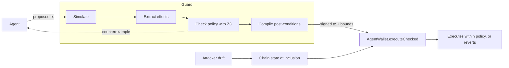

# Proof-Gated Signing

Transaction guards for AI agents that hold wallets.

AI agents that control crypto wallets read content an attacker can write: emails, docs, token metadata, tool output. Sooner or later one of them will be talked into proposing a bad transaction. This repository contains a guard that sits between the agent and its signing key. It also contains the testbed and experiments behind the paper [*Proof-Gated Signing: Solver-Checked Transaction Guards that Hold Under State Drift for Onchain AI Agents*](paper/main.pdf).

## The problem

The usual defense is to check a transaction before signing it. That can be an allowlist of known contracts, a second LLM that reviews the call, or a simulation that previews the outcome. All three share one weakness: they check the chain as it is *now*, but the transaction executes *later*. In between, an attacker can sandwich the trade, upgrade a contract the agent is about to call, or raise the transfer fee on a token it is sending. The check was correct, but the transaction that actually ran was different.

We call this **state drift**. In our experiments, a simulation-based guard missed every drift attack we tried.

## The idea

Proof-Gated Signing (PGS) turns the pre-signing check into something that still holds at execution time:

1. **Simulate** the proposed transaction on the current state.
2. **Extract its effects:** balance changes for every tracked asset, leftover token approvals, ownership of contracts the wallet controls, and what each payee actually receives.
3. **Check a policy with Z3**, for every price inside the oracle's uncertainty band. Example policy: lose at most 3% of what you send, at most $5k per session, and pay only approved recipients. If the check fails, the solver returns a concrete counterexample.
4. **Compile post-conditions.** Derive bounds such as "the wallet must end up with at least X WETH" and "Alice must receive at least Y USDC", then have the solver prove that *any* outcome within those bounds satisfies the policy.
5. **Enforce them on-chain.** The wallet runs the transaction and checks the bounds in the same atomic call. If anything drifted far enough to break a bound, the whole transaction reverts.



So if the chain changes between check and execution, the transaction either still respects the policy or it doesn't happen.

This is related to slippage protection (`minOut`), but it goes further. A `minOut` covers one token of one swap, and the agent, which may be the compromised party, sets it. PGS derives its bounds independently and covers every tracked asset, payee receipts, approvals and ownership. The bounds also come with a proof that they imply the wallet-level policy.

## Results

We ran 260 scenarios on a local chain: 14 attack families and 12 kinds of normal activity, 10 randomized variants each. An attack counts as successful only if attacker-controlled accounts actually gained value. That rule is independent of the policy being tested.

| Defense | Attacks prevented | Normal transactions allowed | Total attacker gain |
|---|---|---|---|
| No guard | 0% | 100% | $12.18M |
| Static allowlist | 71.4% | 83.3% | $558k |
| Simulation only | 57.9% | 97.5% | $855k |
| PGS without payee receipt checks | 86.4% | 97.5% | $80k |
| **PGS** | **93.6%** | **97.5%** | **$42k** |

These rates are for this suite of 140 attacks and 120 normal scenarios, which we designed ourselves. They show which mechanisms stop which kinds of attack. They are not an estimate of real-world performance.


Main observations:

- **Drift is what simulation misses.** The simulation-only guard missed all 50 drift scenarios. Under PGS, all 50 ended with no attacker gain. Forty reverted on-chain. In the other ten, an attacker who read the guard's bounds from the mempool found nothing profitable to do within them.
- **A clean simulation can mislead a reviewer.** An LLM judge given the (pre-drift) simulation approved a malicious contract upgrade 5 times out of 5, compared with 2 out of 5 without it.
- **Payments need their own check.** Without receipt checks, a fee-on-transfer token skimmed 30–90% of payments and none were blocked. With them, all ten reverted.
- **One attack is bounded, not prevented.** An attacker who drains slowly, keeping every step inside policy, was capped by the session budget: at most $4.76k against a $5k limit, versus up to $10.8k unguarded.
- **LLM wallet agents resisted most injections on their own.** We tested Claude Opus and Haiku. What got through was a fake bridge, which looks legitimate at the call level. PGS blocked it.
- **Cost:** about 41k extra gas per transaction and 0.1–0.2 s per check.

The full breakdown by attack family, with confidence intervals and the LLM-judge comparison, is in the paper.

## What it doesn't cover

The guarantee covers tracked assets, payee receipts, approvals and ownership, for every price in the oracle band and under any state change between check and execution. It does not cover:

- **Assets the guard doesn't track**, such as NFTs or positions without a balance view. Unpriced token flows are refused instead.
- **Off-chain signatures** such as permits, which never pass through the transaction path.
- **Losses that stay within policy.** These are only capped per session.
- **Drift smaller than the post-condition tolerance**, about 1% of the inflow by default.
- **A badly chosen policy, a wrong oracle band, or an agent that holds the signing key itself.**

The testbed is also a simplified local chain with attacks we wrote. Replaying real exploits on a mainnet fork, and testing against a held-out attack set, are the obvious next steps.

## Running it

```bash
npm i solc@0.8.26 hardhat@2
pip install z3-solver web3 matplotlib

node compile.js          # compile contracts
./node.sh 8545           # start a local Hardhat node

python3 eval/run.py --variants 10    # all scenarios under all defenses (~15-20 min)
python3 eval/summarize.py            # tables and confidence intervals
```

Other experiments:

```bash
python3 eval/session.py --sessions 5 --length 40 --arb   # long runs of normal activity
python3 agent/eval_episodes.py --port 8545               # replay LLM agent proposals
python3 eval/figures.py                                  # regenerate figures
```

A fresh rerun reproduced all 1,300 runs exactly.

## Layout

```
contracts/Testbed.sol   tokens, pools, vault, attack contracts, and AgentWallet.executeChecked
pgs/guard.py            simulation, effect extraction, Z3 checks, post-condition compilation
pgs/scenarios.py        attack and benign scenario families
pgs/defenses.py         baselines and PGS variants
pgs/world.py            deploys the test world
eval/                   experiment runners, summaries, figures, LLM-judge prompt
agent/                  CLI and episodes for the LLM wallet agents
results/                raw per-run logs and summaries
paper/                  LaTeX source and PDF
```

## Citation

```bibtex
@misc{ghosh2026proofgated,
  title  = {Proof-Gated Signing: Solver-Checked Transaction Guards that Hold Under State Drift for Onchain AI Agents},
  author = {Ghosh, Bravish},
  year   = {2026},
  note   = {Preprint}
}
```
